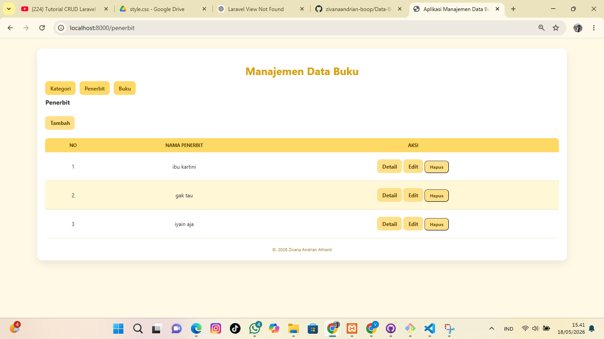
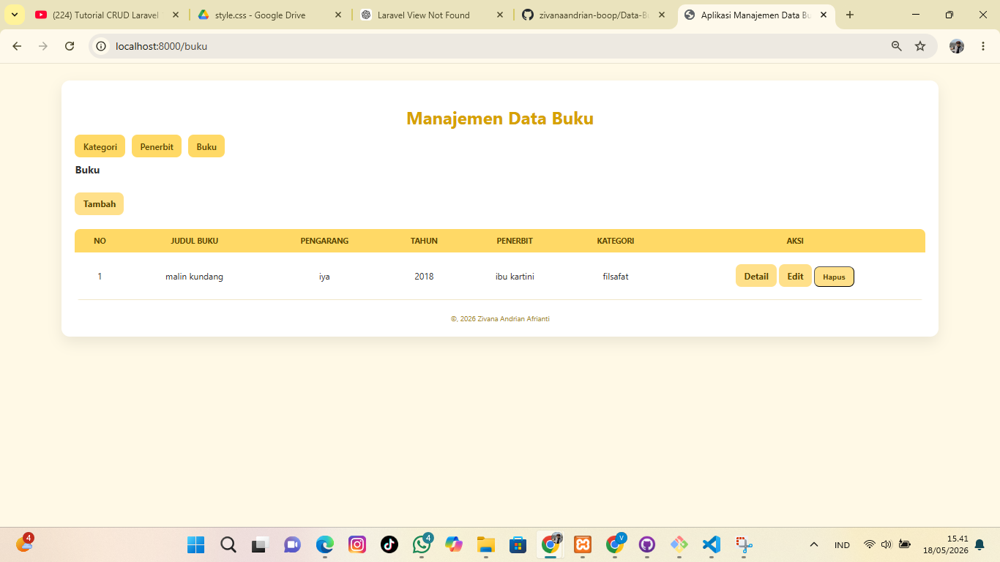

Aplikasi Manajemen Data Buku

Aplikasi ini dibuat untuk mengelola data buku, kategori, dan penerbit. Pengguna bisa menambah, melihat, mengubah, dan menghapus data melalui tampilan web yang sederhana. Ini juga adalah project latihan saya dalam belajar Laravel pertama kali. Fitur yang ada di dalamnya adalah tambah, lihat, edit, dan hapus data.

Tampilan Aplikasi

    

Cara kerja aplikasi
Ketika pengguna membuka halaman, aplikasi akan mengambil data dari database dan menampilkannya dalam bentuk tabel. Pengguna bisa menambah data baru lewat form, mengubah data yang sudah ada, atau menghapusnya. Setiap aksi akan langsung terlihat hasilnya di halaman yang sama.
Aplikasi ini dibuat dengan pola MVC, jadi ada Model yang mengurus data, View yang mengurus tampilan, dan Controller yang jadi penghubung keduanya.
